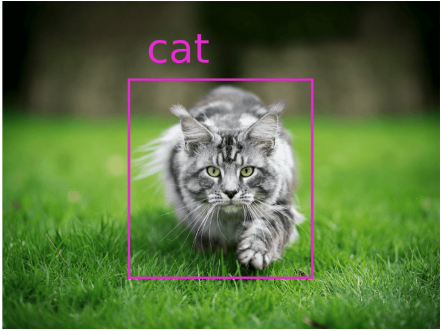

# MOLA - 모두의 라벨링

**개요**

---

모두의 라벨링 서비스는 딥러닝 학습을 위한 데이터를 여러 참여자를 통해 진행할 수 있는 서비스입니다.

딥러닝 학습을 위해서는 컴퓨터가 학습을 하며 참고할 수 있는 정답 데이터를 생성해야합니다.

예를 들어, 컴퓨터가 고양이 이미지를 학습하여 새로운 이미지에서 고양이만을 인식하기를 원할 때, 사용자는 컴퓨터를 위한 학습데이터를 만들기 위해 입력 이미지에서 고양이를 표시해야 합니다.

이미지에서 고양이를 표시한 예시

컴퓨터는 이를 바탕으로 정답 데이터를 참고하여 학습을 진행하고, 새로운 입력에 대한 예측과 판단을 합니다.

이렇게 이미지에서 정답 영역을 표시하는 작업은 데이터 라벨링이라고 칭합니다.

이미지와 같은 데이터의 라벨링은 아직까지는 대부분 사람에 의해 진행되며, 이 과정은 많은 시간과 노력을 필요로 합니다.

따라서, 모두의 라벨링 서비스는 다양한 사람의 참여를 유도하고, 이를 통해 저렴한 시간과 비용으로 데이터 라벨링 작업을 수행할 수 있도록 하는 것이 목표입니다.

**제공기능**

---

1. 의뢰자는 딥러닝 등에 필요한 라벨링용 데이터(이미지)를 업로드합니다.
2. 의뢰자의 이미지는 모두의 라벨링 데이터베이스에 저장되며, 참여자에게 랜덤으로 주어집니다.
3. 참여자는 모두의 라벨링 서비스에 접속하여 랜덤으로 주어지는 데이터(이미지)를 라벨링합니다.
4. 의뢰자는 라벨링이 완료된 데이터를 확인 및 수락합니다.
5. 참여자는 완료된 작업에 대한 보상을 받습니다.
6. 보상은 현금화할 수 있으며, 이미지 당 주어지는 보상은 의뢰자에 의해 결정됩니다.

**개발 환경**

---

- Xcode : 12.4
- iOS : 14.4
- Swift : 5.0

**사용 라이브러리**

---

- Alamofire
- snapKit
- Then
- SideMenu
- Mantis
- MaterialComponents

**로그인 및 회원가입**

---

**메인화면**

---

**크레딧 충전 및 환급**

---

**외주 등록 및 확인**

---

**외주 수행**

---

**발표 동영상 -** [https://www.youtube.com/watch?v=-MrlyuccQN4](https://www.youtube.com/watch?v=-MrlyuccQN4)

**백엔드 -** [https://github.com/yonghole/molaBackend](https://github.com/yonghole/molaBackend)
